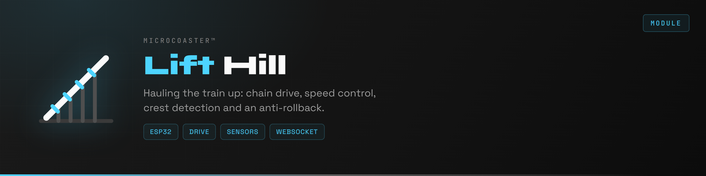
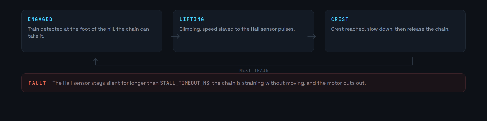
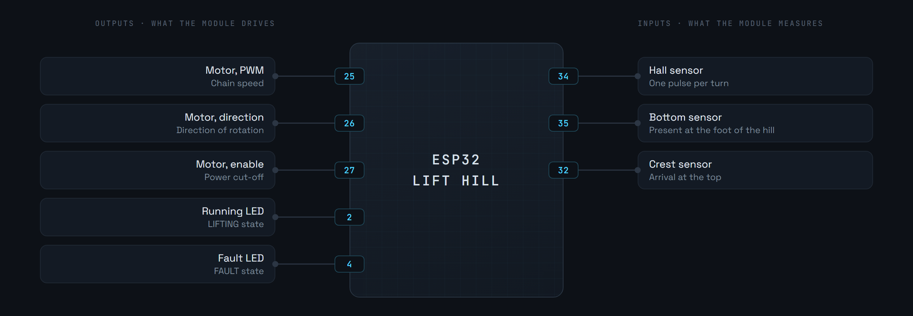
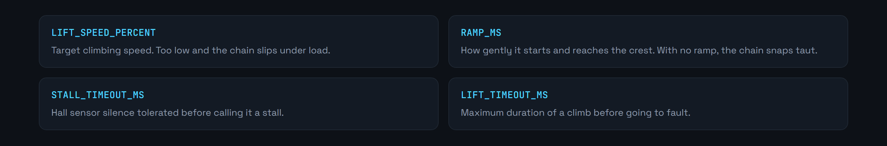

<div align="center">

<p>
  <a href="README.md"></a>
  
</p>



</div>

The lift hill is the classic way of giving the train the energy it will live on for the rest of the layout. A chain takes it at the bottom, hauls it to the crest, then lets go. The module drives the chain motor, watches the real speed and detects the arrival at the top.

Like the other modules, it is configured on first boot through a captive portal, then joins the server over WebSocket.

**Version 0.1.0**


A Hall effect sensor on the shaft gives one pulse per turn. That measurement serves twice: it slaves the speed to the command, and it detects a stall. A chain straining without moving stops producing pulses, and the module cuts out.



The `RAMP_MS` ramps avoid a hard start: without them, the chain snaps taut and the train is jolted at the bottom as much as at the top.


**The anti-rollback is mechanical.** The firmware watches it, it does not replace it. A pawl stops the train running back down, and no line of code should ever stand in for that part.

**Losing the link does not cut the motor mid-climb.** This is the one module where the safe state is not stopping: a train left standing on the slope rolls back down. If the WebSocket drops during a `LIFTING`, the climb finishes, then the module goes back to waiting.

**Two timeouts bound the operation.** `STALL_TIMEOUT_MS` declares a stall if the Hall sensor goes quiet. `LIFT_TIMEOUT_MS` declares a fault if the crest is never reached.







Too low a speed makes the chain slip under load, too high a speed makes the arrival at the crest harsh. `RAMP_MS` fixes the second, not the first.


First copy [`include/env.h.example`](include/env.h.example) to `include/env.h` and fill it in: fallback portal credentials, the module identity and its secret. That file is not in git, and without it the firmware does not compile.

Requires [PlatformIO](https://platformio.org/) inside Visual Studio Code.

```bash
pio run                  # build
pio run -t upload        # upload the firmware
pio run -t uploadfs      # upload the portal to LittleFS
pio device monitor       # serial console, 115200 baud
```

1. Power the module. It creates a WiFi access point.
2. Connect to it and open `http://192.168.4.1`.
3. Enter the target network.
4. The module reboots, joins the network and announces itself to the server.

The credentials stay in the module's memory, never in the repository.


The skeleton, the pinout and the state machine are laid down in `src/main.cpp`. What remains to be written is the speed loop, stall detection on interrupt and reporting telemetry.

The common base for every module is the [WiFi Manager](https://github.com/Microcoaster/MicroCoaster_WifiManager). The other way of giving the train its energy is the [Launch Track](https://github.com/Microcoaster/Launch-Track). The driving is done from the [WebApp](https://github.com/Microcoaster/MicroCoasterWebApp).

---

<sub>MicroCoaster · Author: Cybertrist</sub>
