<div align="center">

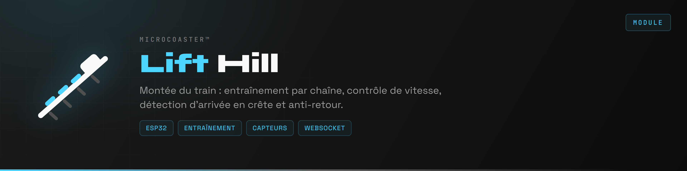

</div>

La montée est la méthode classique pour donner au train l'énergie dont il vivra tout le reste du circuit. Une chaîne l'accroche en bas, le hisse jusqu'en crête, puis le relâche. Le module pilote le moteur d'entraînement, surveille la vitesse réelle et détecte l'arrivée en haut.

Comme les autres modules, il se configure au premier démarrage par portail captif, puis rejoint le serveur en WebSocket.

**Version 0.1.0**

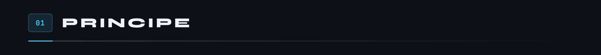

Un capteur à effet Hall sur l'arbre donne une impulsion par tour. Cette mesure sert deux fois : elle asservit la vitesse à la consigne, et elle détecte un blocage. Une chaîne qui force sans avancer ne produit plus d'impulsions, et le module coupe.

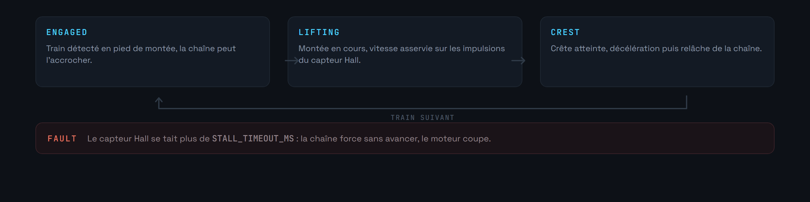

Les rampes de `RAMP_MS` évitent le démarrage sec : sans elles, la chaîne claque et le train est secoué au départ comme à l'arrivée.

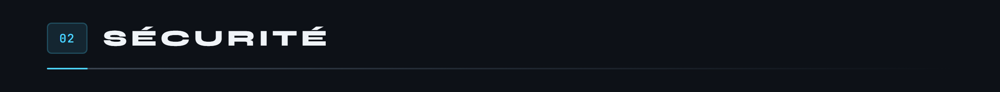

**L'anti-retour est mécanique.** Le firmware le surveille, il ne le remplace pas. Un cliquet empêche la redescente, et aucune ligne de code ne doit servir de substitut à cette pièce.

**Une perte de liaison ne coupe pas le moteur en cours de montée.** C'est le seul module où l'état sûr n'est pas l'arrêt : un train immobilisé en pleine pente redescend. Si le WebSocket tombe pendant un `LIFTING`, la montée se termine, puis le module passe en attente.

**Deux délais bornent l'opération.** `STALL_TIMEOUT_MS` déclare le blocage si le capteur Hall se tait. `LIFT_TIMEOUT_MS` déclare le défaut si la crête n'est jamais atteinte.

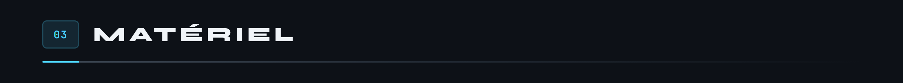

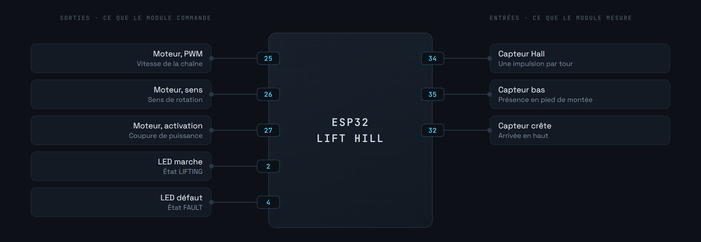

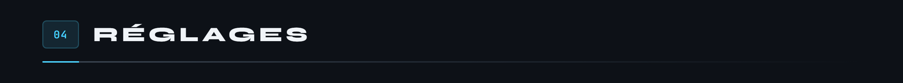

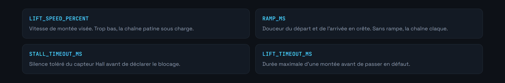

Une vitesse trop basse fait patiner la chaîne sous charge, une vitesse trop haute rend l'arrivée en crête sèche. `RAMP_MS` rattrape la seconde, pas la première.

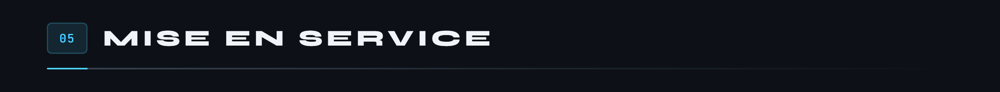

Nécessite [PlatformIO](https://platformio.org/) dans Visual Studio Code.

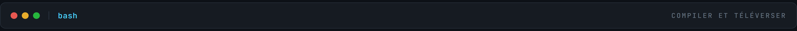

```bash
pio run                  # compilation
pio run -t upload        # téléversement du firmware
pio run -t uploadfs      # téléversement du portail vers LittleFS
pio device monitor       # console série, 115200 bauds
```

1. Alimenter le module. Il crée un point d'accès WiFi.
2. S'y connecter et ouvrir `http://192.168.4.1`.
3. Renseigner le réseau de destination.
4. Le module redémarre, rejoint le réseau et s'annonce auprès du serveur.

Les identifiants restent en mémoire du module, jamais dans le dépôt.

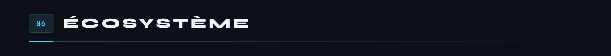

Le squelette, le brochage et la machine à états sont posés dans `src/main.cpp`. Restent à écrire l'asservissement de vitesse, la détection de blocage sur interruption et la remontée de télémétrie.

Le socle commun à tous les modules est le [WiFi Manager](https://github.com/Microcoaster/MicroCoaster_WifiManager). L'autre manière de donner son énergie au train est le [Launch Track](https://github.com/Microcoaster/Launch-Track). Le pilotage se fait depuis la [WebApp](https://github.com/Microcoaster/MicroCoasterWebApp).

---

<sub>MicroCoaster · Auteur : Cybertrist</sub>
